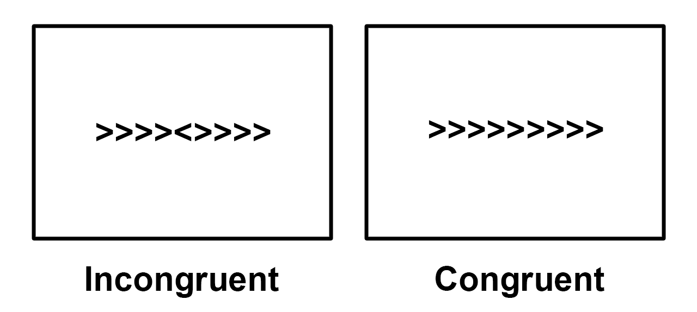
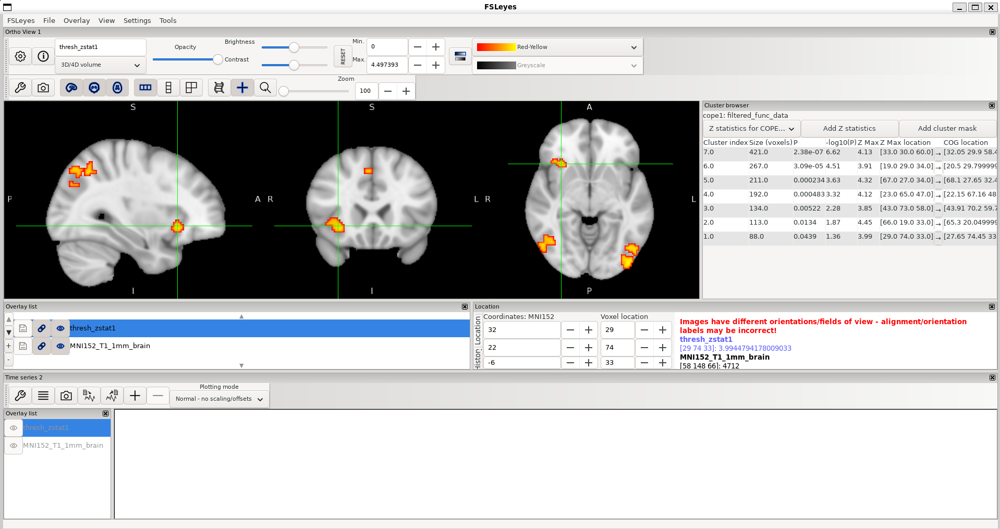
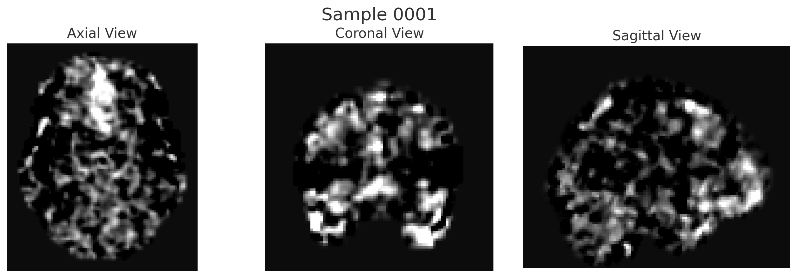
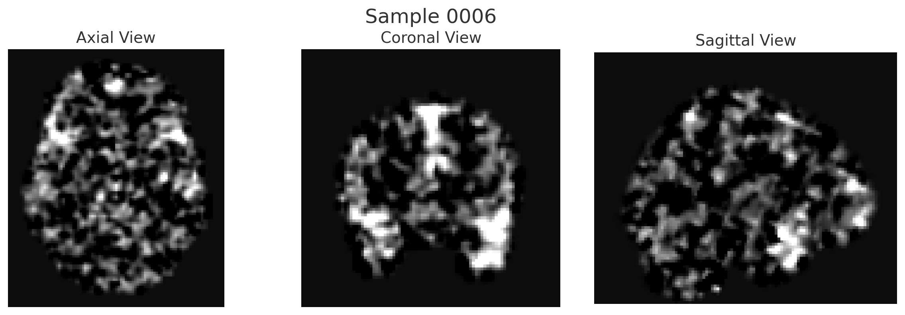
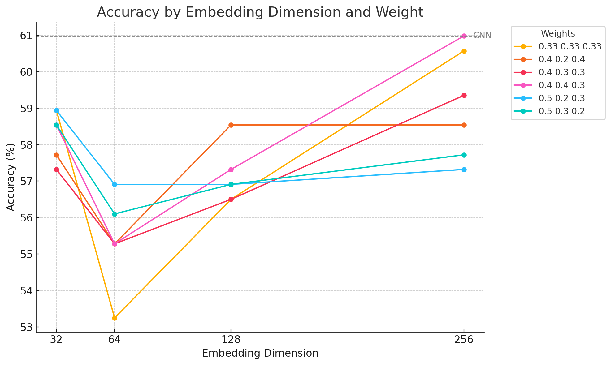
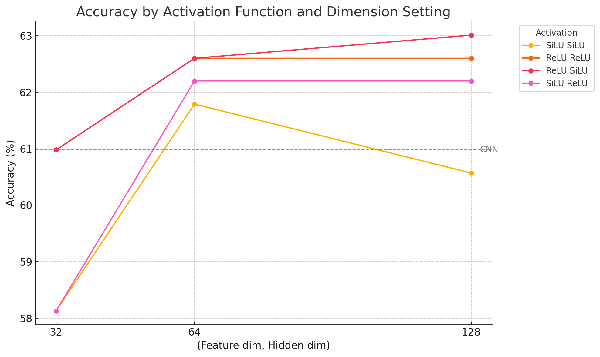

# 🧠 Flanker fMRI analysis and deep learning classifier

## 🚀 About the project

fMRI is an advanced technique for capturing brain functionality. There are plenty of methods to analyze fMRI data, such as FSL, SPM, and AFNI. People can recognize disabilities and brain activity through this analysis, but can a computer do it for us?

In this project, I analyzed fMRI images from the Flanker dataset. Based on the analysis, I built deep learning-based classifier models to distinguish whether the brain is performing a "congruent" task or an "incongruent" task. Due to the small size of the dataset and the presence of noise, the performance was not very good. Therefore, I suggest several alternative approaches, such as a multiview model and a soft voting model. I believe these methods will become more robust with a larger dataset.

## 🧬 fMRI analysis

Functional Magnetic Resonance Imaging (fMRI) is a non-invasive neuroimaging technique used to measure and map brain activity. It detects changes in blood oxygenation levels (BOLD signals) associated with neural activity, allowing researchers to observe which regions of the brain are active during specific tasks or at rest.

**fMRI analysis process in this project is absolutely based on "Andy's Brain Book fMRI Tutorial"**
**If you want to know more about it, you can its address in Appendix**

### 🧪 Flanker dataset

The dataset I used is Flanker task one. It is designed to analyze mental process known as cognitive control.

In Flanker task, arrows point either left or right. The subject is supposed to press one of two buttons "left" or "right".

In congruent condition, the central arrow points the same direction as the flanking arrows. However in incongruent condition, the central arrow points opposite direction as the flanking arrows.

|  |
|:--:|
| **Fig 1. Flanker task example** |

There are 26 subjects and each of them are instructed to do Flanker task about 20 times(including both incongruent and congruent condition).

### ⚙️ Preprocessing

I used FSL program to analyze Flanker task data. I preprocessed raw Flanker task functional data. My preprocessing includes brain extraction, motion correction, slice timing correction, spatial smoothing and registration.

### 📈 Analysis

I used preprocessed data as my learning dataset, but I completed 3rd level analysis to see which voxel distinguish incongruent and congruent condition most significantly.

As a result, I get a voxel (29, 74, 33) which has highest difference between two conditions.

|  |
|:--:|
| **Fig 2. Most significant voxel** |

### 🗂️ Data

I used preprocessed func data as my deep learning dataset. The reason I didn't use 2nd or 3rd level analysis' z-stat data is I needed time-series data. Actually, Capturing signal of preprocessed data is also invisible at first, I did my own preprocessing to the data. By subtracting from mean, scaling signal, I can get these more visible signal data as in figures below. **Fig 3** is from congruent condition and **Fig 4** is from incongruent.

|  |
|:--:|
| **Fig 3. Congruent sample** |

|  |
|:--:|
| **Fig 4. Incongruent sample** |

For doing perfect analysis, we should use whole voxel with 3 view but it takes too much time and almost impossible in my project. So, I used the most significant voxel(29, 74, 33)'s axial, coronal, sagittal views. I captured three views (axial, coronal, and sagittal) for both the congruent and incongruent conditions from 26 participants, resulting in a total of 1,230 data samples. (3 views for 1 sample)

## 🤖 Deep Learning Classification

### 📁 Project structure 🏗️
```
.
├── src/
│   ├── data/
│   │   ├── samples/
│   │   └── labels.csv
│   ├── models/
│   │   ├── __init__.py
│   │   ├── cnn_classifier.py
│   │   ├── multiview_classifier.py
│   │   └── model_select.py
│   ├── utils/
│   │   ├── __init__.py
│   │   ├── dataset.py
│   │   └── learning.py
│   ├── test.py
│   └── train.py
├── README.md
└── requirements.txt
```

- src
  - data 
    - you can find fMRI image files and label csv files
  - models
    - you can find model classes
  - utils
    - you can find useful functions
  - train.py
  - test.py
- requirements.txt
  - necessary packages to run the codes

### 🛠️ Getting started
These commands are expected to exectued in ```src``` dir
#### 🖼️ Train & Test
```
python3 train.py --model "model"
```
Also, there are ```--batch_size --epochs --lr --width``` arguments to control training hyperparameters.
```
python3 test.py --model "model"
```
There are ```--batch_size --width``` arguments.

I have implemented 3 options for ```--model``` argument, ```cnn```, ```multiview```, ```softvoting```. You can choose your image width with ```--width``` option and I experimented images with ```256```, ```320```, ```384```. If you want to change your image width, you are supposed to change models' layers and channels properly in order to get good result.

### 📊 Experiments & Results
#### 🖼️ Classic CNN
First, I trained Classic CNN Classifier. You can find detail of this model in ```src/models/cnn_classifier.py```.

I used ```epochs=10``` as a fixed hyperparameter in this whole project as data size is too small to use many epochs. I trained CNN model with various parameter options to figure out which option is the most important option. I started from learning rate to image resolution, embedding channels. The result is shown in the below tables.

| Learning Rate     | Training Accuracy(%) | Test Accuracy(%) |
|:-----------------:|:------------:|:----------:|
| 1e-3 | **96.04**  | 55.28   |
| 5e-4 | 92.78  | 57.72   |
| 1e-4 | 75.61  | **59.76**   |

**Table 1. CNN model results by various learning rate**

I trained with three different learning rate options. This experiment is processed in condition ```width=256, hidden_channels=[8, 16, 32], embedding_dimension=128, dropout_rate=0.4```. In **Table 1**, we can see that the lowest learning rate, 1e-4, achieves the best test performance. In contrast, both 1e-3 and 5e-4 show significant overfitting (very high accuracy in training, but low test accuracy). Therefore, it would be better to use the lower learning rate of 1e-4 going forward.

Next, I tuned another hyperparameter: the image width.

| Image width   | Training Accuracy(%) | Test Accuracy(%) |
|:-----------------:|:------------:|:----------:|
| 256 | 75.61  | **59.76**   |
| 320 | 81.00  | 57.72   |
| 384 | **85.98**  | 58.13   |

**Table 2. CNN model results by various image width**

The original image resolutions were 750×750 (coronal), 626×750 (axial), and 750×626 (sagittal). Due to limitations in GPU memory and processing time, I resized these images to 256×256, 320×320, and 384×384, and tested the performance at each resolution.

Before the experiment, I expected that higher-resolution images would yield better performance. However, contrary to my expectations, lower-resolution images achieved higher test accuracy and showed less overfitting. As you can see in **Table2**, 320x320 and 384x384 showed more overfitting than 320x320. So, I fixed the image width 256 and continued the expriment.

| Embedding channels   | Training Accuracy(%) | Test Accuracy(%) |
|:-----------------:|:------------:|:----------:|
| 128 | **75.61**  | 59.76   |
| 64 | 73.37   | 60.16   |
| 32 | 71.34  | **60.98**   |

**Table 3. CNN model results by various image width**

After fixing the image resolution to 256×256, I proceeded to experiment with different values for the number of embedding channels.

As shown in **Table 3**, when the number of embedding channels was increased to 128, the training accuracy improved noticeably. However, the test accuracy decreased compared to smaller channel sizes, indicating overfitting. The configuration with 32 embedding channels achieved the highest test accuracy (60.98%) despite having the lowest training accuracy. This suggests that a smaller embedding size may help prevent overfitting and generalize better to unseen data in this setting.

I found the most well-performing parameter option in CNN model, but can we achieve better performance with other approach? I came up with the idea that each view could have a different meaning. So I tried with 2 other methods, soft voting and multiview network. 

#### 🖼️ Soft voting

Soft voting aggregates the predicted probabilities from multiple models—optionally with weights—and selects the class with the highest weighted average probability. In my project, I splitted 3 views in a sample separately and trained each network and combine the result with weighted average. The training was under ```width=256, hidden_channels=[4, 8], dropout_rate=0.4``` and I changed embedding dimensions from 32 to 64, 128, 256 and used different weights. The result is in **Fig 5** and weights = (axial, coronal, sagittal).

|  |
|:--:|
| **Fig 5. Softvoting results by various embedding dims and weights** |

The weights are determined by the result that training accuracy was the highest in model which uses only axial view. As shown in **Fig 5**, ```embedding_dimension=256``` and ``weights=[0.4 0.4 0.3]`` achieves the best accuracy. Assigning more weight to axial view has better accuracy than others but there was no significant improvement.  So I tried to find hidden relation between each view using network rather than just fixed weight. 

#### 🖼️ Multiview Network

Multiview approach is similar to soft voting in point that they are using different parameters for each view. Instead of calculating weight average, multiview approach goes through some more network layers. You can see the detail of multiview model in ```src/models/multiview_classifier.py```.

This experiment was under the condition ```width=256, hidden_channels=[4, 8], dropout_rate=0.4```. I changed ```feature_dim``` and ```hidden_dim``` from 32 to 64, 128 also different activation functions(SiLU or ReLU).

|  |
|:--:|
| **Fig 6. Multiview results by various feature dims and activiation functions** |

As you can see in **Fig 6**, many of them achieved better performance than CNN or softvoting. Especially, (ReLU, SiLU) combination with ```feature_dim=128, hidden_dim=128``` was the best among them. In the same (ReLU, SiLU) activation function setting, I tried with some more dimensions and get the very last combinations.

| Feature dim, Hidden dim  | Test Accuracy(%) |
|:-----------------:|:------------:|
| (64, 32) | **63.41**  |
| (128, 64) | 62.20   |
| (128, 32) | 62.20  |

**Table 4.Multiview with (ReLU, SiLU) results by various hidden dimensions**

### 💡 Discussion

At first, I started with accuracy about 55% in classifying Flanker task condition. It seems like useless but if you look at the sample images in ```src/data/samples/``` you will notice that even human cannot distinguish two conditions. In that sense, just 55% accuracy is meaningful. However, I thought there would be another method to improve this model, and tried softvoting approach and multiview approach. With softvoting approach, I couldn't improve the accuracy but got the intuition that each view can have different meanings. Finally using multiview approach, I could get the 63% accuracy which is much better than human.

Then, why the test accuracy couldn't be over 70% or 80%? It's absolutely because of data. Since fMRI captures brain images at each TR (repetition time), it is not feasible to include all time points. Moreover, due to individual variability, the timing of stimulus presentation after the onset of a task like the Flanker task can differ across subjects. In this project, I used the brain's functional image acquired 6 seconds after the stimulus appeared. However, this may not accurately reflect task-specific brain activation.

In addition, while deep learning models typically require datasets with millions of images—or at least tens of thousands even for small-scale projects—it is challenging to collect large amounts of fMRI data due to the substantial data size and the complexity of data acquisition. Furthermore, fMRI data is inherently noisy, which increases the risk of overfitting in deep learning models.

## 📩 Contact

If you have any issues or questions, suggestions about this repository. Please contact me chlwodnd0718@snu.ac.kr.

## 📂 Appendix

Andy's Brain Book FMRI SHORT COURSE : https://andysbrainbook.readthedocs.io/en/latest/fMRI_Short_Course/fMRI_Intro.html
